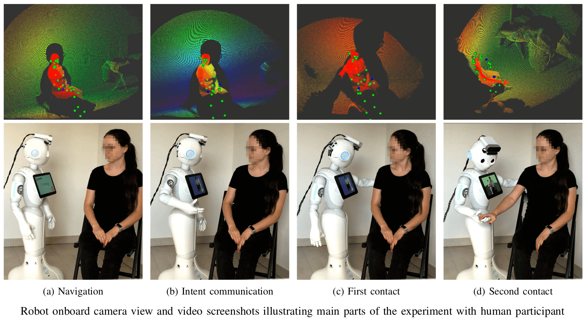

# Autonomous Initiation of Human Physical Assistance by a Humanoid

This repository contains the Finite State Machine (FSM) [`mc_rtc`](https://jrl-umi3218.github.io/mc_rtc/) controller used in the experiments presented in our work titled ["Autonomous Initiation of Human Physical Assistance by a Humanoid"](https://hal.archives-ouvertes.fr/hal-02615390/document) published in [RO-MAN 2020](http://ro-man2020.unina.it/) conference proceedings

---

## `topic/withHumanModel` branch

On this branch we present a simulation of the controller for pHRI experiment using following auxiliary models

* Human model from [`mc_human`](https://gite.lirmm.fr/multi-contact/mc_human)
* Chair model from [`mc_rtc_data`](https://github.com/jrl-umi3218/mc_rtc_data)



---


### Author, Contact, BibTeX

Anastasia Bolotnikova (a.bolotnikova[at]softbankrobotics.com)

```
@inproceedings{bolotnikova2020roman,
  author = {Anastasia Bolotnikova and S{\'e}bastien Courtois and Abderrahmane Kheddar},
  title = {Autonomous Initiation of Human Physical Assistance by a Humanoid},
  booktitle = {IEEE International Conference on Robot and Human Interactive Communication},
  address = {Naples, Italy},
  month = {31 August--4 September},
  year = {2020}
}
```


## Branches

* `master` - controller for real experiment using [Azure Kinect Body Tracking](https://docs.microsoft.com/en-us/azure/kinect-dk/body-sdk-download) visual feedback for navigation towards a person, and contact detection (DOI: [10.1109/ROMAN.2018.8525774](https://ieeexplore.ieee.org/abstract/document/8525774), [10.1109/HUMANOIDS.2018.8624946](https://ieeexplore.ieee.org/abstract/document/8624946)) for establishing contacts with human in closed loop
* `topic/withHumanModel` - controller for experiment simulation with a [human model](https://gite.lirmm.fr/nana/mc_human)

This repository is a fork of a base Pepper FSM `mc_rtc` controller [PepperFSMController](https://gite.lirmm.fr/mc-controllers/pepperfsmcontroller).

## Required packages

* [`mc_rtc`](https://jrl-umi3218.github.io/mc_rtc/tutorials/introduction/installation-guide.html)
* [`mc_pepper`](https://gite.lirmm.fr/multi-contact/mc_pepper)
* [`mc_human`](https://gite.lirmm.fr/multi-contact/mc_human)
* [`mc_rtc_data`](https://github.com/jrl-umi3218/mc_rtc_data)

## List of FSM states

* StandStraight
* NavigateToHuman
* IntentCommunication
* PreContactBack
* MakeContactBack
* PreContactHand
* MakeContactHand
* RemoveContactHuman
* RemoveContacts
* MoveMobileBase

## Cloning , bilding and installing the controller

```bash
git clone git@gite.lirmm.fr:nana/pepperfsmcontroller-roman2020.git
cd pepperfsmcontroller-roman2020
mkdir build
cd build
cmake ..
make
sudo make install
```

## Running the controller

Use your preferred interface to run this controller. Some option are:

* [`mc_rtc_ticker`](https://github.com/jrl-umi3218/mc_rtc_ros/tree/master/mc_rtc_ticker) from [`mc_rtc_ros`](https://github.com/jrl-umi3218/mc_rtc_ros) (simulation only)
* [`mc_naoqi`](https://gite.lirmm.fr/multi-contact/mc_naoqi) (for experiments with real robot)

To run this controller, make sure to setup correctly following interface configuration entries:

```yaml
# Main robot in controller
MainRobot: PepperExtraHardware
# Enabled controller
Enabled: PepperFSMController_RO-MAN2020
```
## Visualizing the controller in [`RViz`](https://wiki.ros.org/rviz)

To visualize controller state in [`RViz`](https://wiki.ros.org/rviz), you will first need to ensure that you have [ROS](https://www.ros.org/) installed and [`mc_rtc`](https://github.com/jrl-umi3218/mc_rtc) built with [ROS](https://www.ros.org/) support.

Run `roslaunch launch/display.launch]`, using [`display.launch`](launch/display.launch) file provided in this repository, to launch controller display `RViz` node.

Once `RViz` node is started, configure it by clicking in `RViz` `File -> Open Config -> select file `[`roman2020_display.rviz`](launch/roman2020_display.rviz), provided in [`launch`](launch) folder in this repository

##### Add RViz configuration to ROS path

Optionally, you can configure `RViz` to use [`roman2020_display.rviz`](launch/roman2020_display.rviz) configuration automatically when running `roslaunch launch/display.launch` by adding it to your ROS path:

```
cp launch/roman2020_display.rviz ~/.ros/
```

# Acknowledgment

Thanks to @gergondet and @atanguy for reviewing and helping with this controller and the [`mc_rtc`](https://jrl-umi3218.github.io/mc_rtc/) framework
